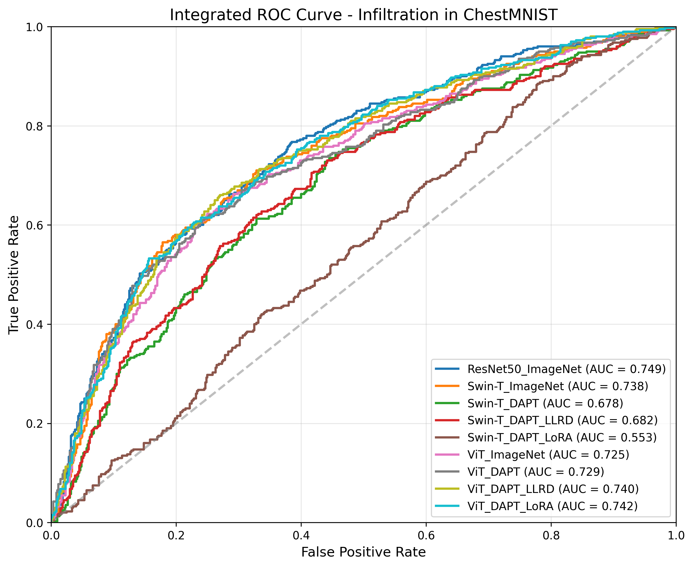
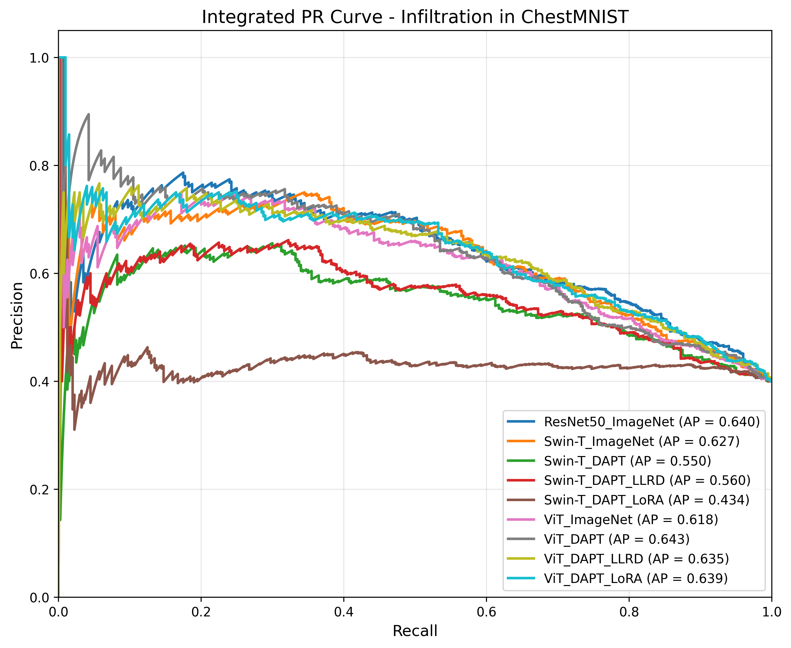

# 影像模型實驗成果與比較分析報告

本報告針對目前在影像分支 (Image Branch) 所進行的三種主要電腦視覺模型（ResNet50, Swin-Transformer, Vision Transformer (ViT)）之訓練與微調結果進行統整，包含資料準備、模型設定以及最終效能結果比較。

## 1. 資料來源與分割設定

本次實驗所使用的主要資料集以及其取樣設定如下：

*   **資料來源：** [ChestMNIST](https://medmnist.com/) (隸屬於 MedMNIST 資料集)，任務為預測肺部 X 光影像中是否患有**肺浸潤 (Infiltration)** 症狀的二元分類問題。
*   **影像大小：** 224 x 224。
*   **總資料量與分割 (Subset 10k Binary)**：為了加速實驗並確保正負樣本比例，採用了採樣機制 (Subsampling)，抽取出總共 10,000 筆資料。
    *   **訓練集 (Training Set)：** 8,000 筆
    *   **驗證集 (Validation Set)：** 1,000 筆
    *   **測試集 (Test Set)：** 1,000 筆
*   **類別比例：** 此子集被設定為固定含有 40% 的正樣本 (`SUBSAMPLE_POS_RATIO = 0.4`)，以解決原資料集潛在的不平衡問題。

## 2. 訓練之模型與策略

本次實驗使用了標準卷積神經網路 (CNN) 與近年主流的視覺 Transformer 進行比較，並導入了多種預訓練、Learning Rate Decay (LLRD) 學習率策略 及 Parameter-Efficient Fine-Tuning (PEFT) 策略。

### 訓練模型架構與特性比較

以下針對本次實驗採用的三種模型之核心技術、優勢以及文獻進行簡要說明：

#### 1. ResNet50 (Residual Network 50)
*   **核心技術：** 最為經典的卷積神經網路 (CNN) 架構之一。其突破性在於引入「殘差連接 (Residual Connections)」，允許神經網路在計算中跳過某些層級，將前一層的輸入直接加到輸出上，成功解決了深度神經網路在層數過深時容易產生的「梯度消失 (Vanishing Gradient)」問題。
*   **模型優勢：** 具有強大的局部特徵萃取能力與歸納偏置 (Inductive Bias)。架構極其成熟且非常穩定，即便在資料量有限的小型資料集上也不容易遭遇嚴重的過擬合，經常作為特徵挖掘與醫學影像分類任務的黃金基準模型 (Baseline)。
*   **參考文獻：** He, K., et al. (2016). Deep Residual Learning for Image Recognition. *arXiv preprint arXiv:1512.03385*. [[文獻連結]](https://arxiv.org/abs/1512.03385)

#### 2. Vision Transformer (ViT)
*   **核心技術：** 完全捨棄傳統的卷積操作，大膽將影像切分成固定大小的區塊 (Patches) 並攤平成一維序列，如同將影像視為一段句子中的單字 (Tokens)，接著送入源自 NLP 領域的自注意力機制 (Self-Attention) 架構中進行全域性學習。
*   **模型優勢：** 打破 CNN 只能受限於局部感受野進行特徵融合的限制，能建構出捕捉輸入影像「全域性關聯 (Global Context)」的表示能力。在資料量龐大並搭配足夠的預訓練權重時，其分類準確率以及泛化效能往往能超越最頂尖的 CNN 架構。
*   **參考文獻：** Dosovitskiy, A., et al. (2020). An Image is Worth 16x16 Words: Transformers for Image Recognition at Scale. *arXiv preprint arXiv:2010.11929*. [[文獻連結]](https://arxiv.org/abs/2010.11929)

#### 3. Swin-Transformer (Shifted Window Transformer)
*   **核心技術：** 試圖融合 CNN 局部性與 ViT 全域性的一個進階階層式 Transformer 變體。透過限制 Self-Attention 只在局部的「視窗 (Window)」內計算以大幅降低運算複雜度，並在層與層之間交替「平移視窗 (Shifted Window)」，讓不同視窗之間能夠有效地進行跨區域訊息交換。
*   **模型優勢：** 兼具 Transformer 架構的彈性與傳統卷積網路「層級性縮小解析度 (Hierarchical)」的優良傳統。這使得其計算複雜度隨影像大小僅呈線性增長而非平方增加，特別適合處理高解析度影像與保留微細特徵。
*   **參考文獻：** Liu, Z., et al. (2021). Swin Transformer: Hierarchical Vision Transformer using Shifted Windows. *arXiv preprint arXiv:2103.14030*. [[文獻連結]](https://arxiv.org/abs/2103.14030)

#### 綜合比較表

綜合比較各影像模型特性的差異：

| 比較項目 / 模型 | ResNet50 | Vision Transformer (ViT) | Swin-Transformer |
| :--- | :--- | :--- | :--- |
| **模型架構** | 卷積神經網路 (CNN) | 視覺轉換器 (Vision Transformer) | 階層式視覺轉換器 |
| **核心處理機制** | 局部卷積 (Convolution) | 全域自注意力 (Global Self-Attention) | 局部視窗自注意力 (Window Self-Attention) |
| **空間結構特徵** | 解析度逐層遞減 (Hierarchical)| 始終維持單一解析度分塊 | 解析度逐層遞減 (Hierarchical) |
| **歸納偏置程度**| 高 (天生自帶影像平移不變性) | 極低 (需依賴龐大資料進行自我學習) | 中 (融合了局部運算特性與平移機制) |
| **性能極限**| 容易遭遇瓶頸飽和 | **極高** (總資料量越大，優勢越明顯) | 高 (在多尺度預測任務上表現優異) |
| **小樣本穩定能力**| **最強** (極容易收斂且表現穩定) | 偏弱 (強烈仰賴極佳的預訓練起始權重) | 普通 (視預訓練權重的領域適應性而定) |
| **優勢與應用場景**| 運算速度快、常做為基準(Baseline)首推 | 解譯全域複雜特徵、擁有龐大預訓練權重時 | 適合需要多尺度特徵融合的精細視覺任務 |

### 預訓練策略 (Pre-training)
所有模型皆比較了兩種初始權重：
*   **ImageNet-1K:** 標準的大規模影像資料集預訓練權重。
*   **DAPT (Domain-Adaptive Pre-Training):** 針對醫療/專屬領域資料進行的無監督或自監督適應性預訓練。 ResNet 採用的 Spark，Swin-T 採用的 SimMIM，以及 ViT 採用的 MAE (Masked Autoencoders) 等產出的局部最佳權重。預訓練權重所使用的資料集為**完整的 ChestMNIST 訓練集 (約 78,468 張影像)**。

### 微調機制 (Fine-Tuning, FT)
對於 Transformer 架構 (ViT & Swin-T) 的 DAPT 權重，進一步嘗試了以下幾種進階 FT 機制：
1.  **標準全參數微調 (Standard FT):** 預設策略。
2.  **LLRD (Layer-Wise Learning Rate Decay):**
    *   **參數：** 衰減率 `LLRD_DECAY = 0.85`。
    *   **方法：** 針對深層網路，學習率從頂層到底層逐漸遞減，有助於保留預訓練底層特徵，同時讓頂層更好地適應新任務。
3.  **LoRA (Low-Rank Adaptation):**
    *   **參數：** `R (Rank) = 16`, `Alpha = 32`, `Dropout = 0.1`, `Learning Rate = 5e-4`。
    *   **方法：** 凍結原始預訓練權重，僅在注意力矩陣旁插入可訓練的低秩分解矩陣，大幅減少訓練參數，同時避免 Catastrophic Forgetting，節省 GPU 資源。

---

## 3. 結果分析與比較

評估結果與圖表請參考 [`image_comparison_results`](./image_comparison_results/)資料夾中的圖表與 csv 檔案。

### 模型曲線比較 (ROC & PR Curves)

  
  

### 評估指標 (Metrics) 

參考目前的評估指標 (`Model_Comparison_Metrics.csv`) 進行分析：

| Model | Accuracy | Precision | Recall | AUC | AP (Avg Precision) |
| :--- | :---: | :---: | :---: | :---: | :---: |
| **ResNet50_ImageNet** | 0.691 | 0.6086 | 0.6375 | **0.7486** | 0.6402 |
| **Swin-T_ImageNet** | **0.715** | 0.6696 | 0.5675 | 0.7378 | 0.6273 |
| Swin-T_DAPT | 0.645 | 0.5843 | 0.3900 | 0.6783 | 0.5504 |
| Swin-T_DAPT_LLRD | 0.655 | 0.6022 | 0.4050 | 0.6821 | 0.5598 |
| Swin-T_DAPT_LoRA | 0.589 | 0.4225 | 0.0750 | 0.5533 | 0.4336 |
| ViT_ImageNet | 0.698 | 0.6512 | 0.5275 | 0.7252 | 0.6179 |
| ViT_DAPT | 0.703 | 0.6604 | 0.5300 | 0.7291 | **0.6434** |
| ViT_DAPT_LLRD | 0.707 | 0.6499 | **0.5800** | 0.7404 | 0.6346 |
| **ViT_DAPT_LoRA** | 0.705 | 0.6606 | 0.5400 | **0.7422** | 0.6390 |

### 分析結論：

1.  **曲線離散度反映模型特性 (ROC 與 PR 圖表解釋)：**
    從 ROC 與 PR 曲線圖中可以非常顯著地觀察到各個模型的落差形態：
    *   **領先群：** **ResNet50** 與經過完整微調的 **ViT (DAPT+LoRA)** 曲線弧度最為飽滿，包覆在最外側，且在 PR 曲線中能長效維持較高的 Precision 緩步下降。
    *   **失常陷阱：** 反觀 **Swin-T (DAPT+LoRA)** 的 ROC 曲線幾乎貼近 45 度角的對角線（如同盲猜），PR 曲線更是呈現斷崖式墜落，完全喪失鑑別力。這些視覺化曲線十分直觀地反映了底層不同網路結構處理醫學影像特徵時出現的適應性懸殊差異。

2.  **基準模型依然強大：**
    **ResNet50 (ImageNet)** 在未經任何複雜微調機制的狀況下，達到了最高的 AUC (0.7486) 以及良好的召回率 (0.6375)。這顯示傳統 CNN 對於此類醫學影像（尤其是資料量受限於 10k 時）具有極強的穩定性與歸納偏置 (Inductive Bias)。
    
3.  **ViT 與微調策略的有效結合：**
    *   ViT 在套用 DAPT 後，效能穩定超越單純的 ImageNet 權重。
    *   在 DAPT 基礎上加入 **LLRD** 或 **LoRA** 後，不但維持了優異的準確率 (~0.705)，其 AUC 更是提升至 ~0.74 (逼近 ResNet50 baseline)。
    *   這證明了對於 ViT，使用 DAPT 搭配 Parameter-Efficient 的微調方法 (尤其是 LLRD 與 LoRA) 是一個相對成功且穩健的策略。

4.  **Swin-Transformer 的領域適應困境：**
    *   **Swin-T (ImageNet)** 的原始表現相當出眾 (Accuracy高達 0.715)，但一旦換用 **Swin-T (DAPT)**，所有指標皆出現顯著下滑 (AUC 從 0.7378 跌至 0.6783)。
    *   將 **LoRA** 套用於 Swin-T_DAPT 時幾乎崩潰，Recall 降至 0.075 (模型幾乎無法預測出正樣本)，AUC 掉至 0.5533 (近乎隨機猜測)。
    *   **可能原因 (特徵崩潰與目標過擬合)：**
        1. **預訓練任務過度擬合 (Overfitting)：** Swin-T 依賴於「局部視窗注意力 (Window Attention)」。在進行 SimMIM (遮蔽重建) 這類 DAPT 時，模型極易過度擬合 X 光片中高度重複的局部特徵（如肋骨邊緣、儀器雜訊），導致模型遺忘原先 ImageNet 權重具備的輪廓辨識能力（災難性遺忘）。
        2. **LoRA 轉換空間不足：** 肺浸潤判斷需要完整的肺部結構，然而當高度特化於局部紋理的權重進入微調訓練時，LoRA (Rank=16) 提供較小的參數更新空間，無法將局部紋理特徵轉回全局病理特徵。模型陷入解碼困境，選擇放棄預測正樣本 (導致 Recall 崩盤)。反觀 ViT 由於具備全域注意力，能觀察影像全域特徵，因此未發生此現象。

### 後續建議：

1.  **針對 Swin-T 的預訓練優化策略:**
    *   **轉換 DAPT 任務:** 鑑於 SimMIM 易造成的局部過度擬合，建議將自監督學習任務轉換為**語意對比學習 (Contrastive Learning)**（如 MoCo v3 或 DINO ）。透過多視角影像對立，強迫 Swin-T 學習肺部的全域病理特徵，減少對局部像素紋理的依賴。
    *   **改良遮蔽策略:** 如需沿用 MIM 機制，建議提高遮擋率 (Masking Ratio 增至 75% 以上)，或引進大區塊遮擋 (Block-wise Masking)，逼迫模型必須利用上下文關聯來重建解剖結構。
    *   **退回基準狀態:** 若短期內無法調整預訓練架構，建議 Swin-T 暫時放棄當前 DAPT 權重，直接退回 ImageNet 權重進行測試，以確保基本的收斂穩定性。

2.  **調整 LoRA 微調參數設定:**
    *   面對 Swin-T 此類複雜架構，預設 Rank=16 顯然不足以應付特徵空間的巨幅轉換。後續可嘗試調高 Rank 值 (如 32 或 64)，以釋放足夠的微調自由度。

3.  **整體專案模型定位與應用:**
    *   **研發主力:** 目前 **ViT + DAPT + LoRA** 組合表現最為優異。印證「全局注意力」架構在醫學影像自監督適應中的高穩定性，可作為視覺 Transformer 模型後續發展的主要選擇。
    *   **穩健對照組:** 傳統卷積網路 **ResNet50** 憑藉局部特徵提取的模型架構，在此資料量級下依然展現良好的 AUC，可作為推進實驗時的基準模型 (Baseline)。
