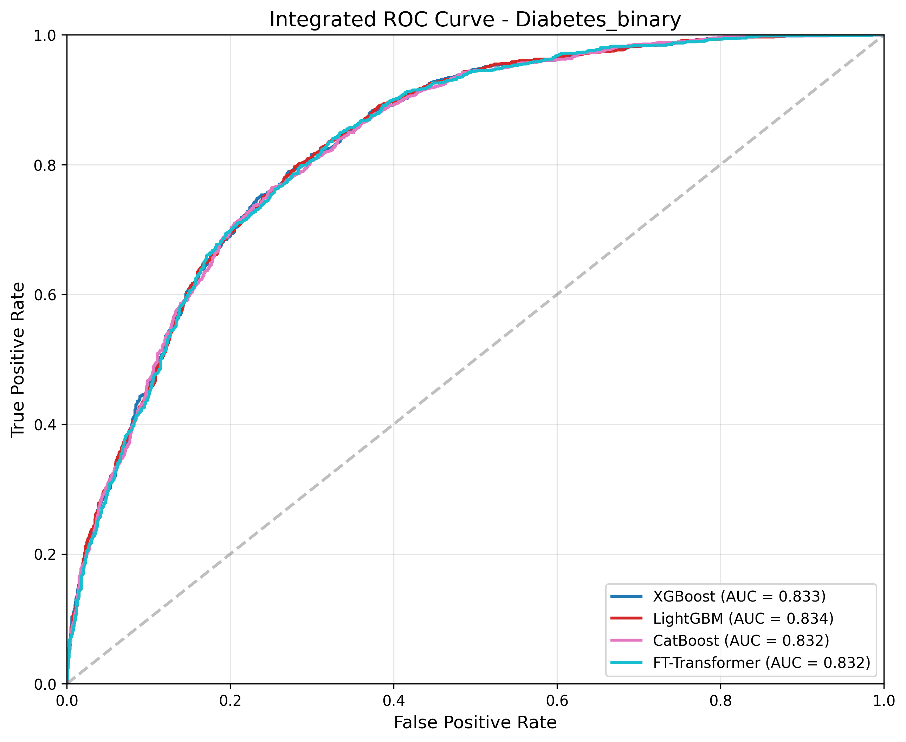
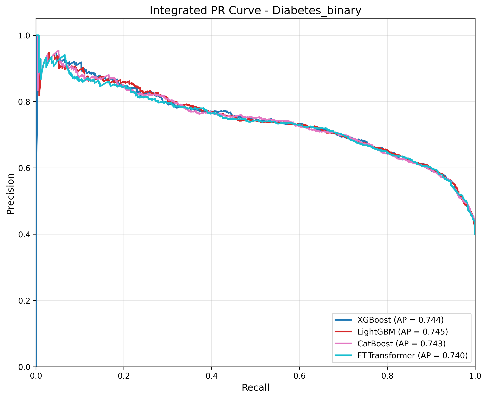

# 結構化資料 (Tabular) 模型實驗成果與比較分析報告

本報告針對目前在結構化資料分支 (Tabular Branch) 所進行的四種主流機器學習與深度學習模型（XGBoost, LightGBM, CatBoost, FT-Transformer）之訓練與評估結果進行統整，包含資料準備、模型設定以及最終效能比較。

## 1. 資料來源與分割設定

本次實驗所使用針對結構化資料集的處理與取樣設定如下：

*   **資料來源：** `diabetes_binary_health_indicators_BRFSS2015.csv`，任務為預測是否患有糖尿病 (`Diabetes_binary`) 的二元分類問題。
*   **總資料量與取樣 (Subset 20k)：** 為了平衡運算資源與保證代表性，從原始資料集中抽取了 20,000 筆資料作為本次實驗的子集。
*   **類別比例設定：** 採用了特定的 4:6 目標比例進行抽樣，確保資料的不平衡度在可控範圍內：
    *   **正樣本 (患病)：** 8,000 筆 (40%)
    *   **負樣本 (未患病)：** 12,000 筆 (60%)
*   **資料集分割 (Train/Val/Test)：** 採用 70% / 15% / 15% 比例進行分層隨機分割 (Stratified Split)，以維持各資料集中的正負樣本比例一致：
    *   **訓練集 (Training Set)：** 14,000 筆
    *   **驗證集 (Validation Set)：** 3,000 筆
    *   **測試集 (Test Set)：** 3,000 筆

## 2. 訓練之模型與策略

在特徵工程部分，將 `BMI`, `MentHlth`, `PhysHlth` 列為連續型數值特徵 (採用 `StandardScaler` 標準化)，其餘皆視為類別型特徵 (採用 `OrdinalEncoder` 轉為整數索引)。
本次選用了三種主流的梯度提升樹 (GBDT) 框架以及一種專為結構化資料設計的 Transformer 深度學習模型：

### 梯度提升樹模型 (GBDTs)
各模型經由 Optuna 進行超參數優化（Hyperparameter Optimization）後的最終設定如下：
1.  **XGBoost:**
    *   **樹木叢集數量 (n_estimators)：** 1000
    *   **樹的最大深度 (max_depth)：** 4
    *   **學習率 (learning_rate)：** 0.01
    *   **訓練樣本抽樣比例 (subsample)：** 0.55
    *   **特徵隨機抽樣比例 (colsample_bytree)：** 0.55
    *   **最小節點權重 (min_child_weight)：** 3
    *   **提早停止設定 (early_stopping_rounds)：** 50，於驗證集監控 `logloss`。
2.  **LightGBM:**
    *   **樹木叢集數量 (n_estimators)：** 1000
    *   **樹的最大深度 (max_depth)：** 3
    *   **學習率 (learning_rate)：** 0.02
    *   **訓練樣本抽樣比例 (subsample)：** 0.5
    *   **特徵隨機抽樣比例 (colsample_bytree)：** 0.5
    *   **L2 正規化係數 (reg_lambda)：** 0.9
    *   **提早停止設定 (early_stopping_rounds)：** 50
    *   **特徵處理：** 直接指定 `categorical_feature` 欄位以利用演算法內建的特徵分割技巧。
3.  **CatBoost:**
    *   **樹木叢集數量 (iterations)：** 1000
    *   **樹的最大深度 (depth)：** 8
    *   **學習率 (learning_rate)：** 0.03
    *   **L2 葉片正規化 (l2_leaf_reg)：** 1.8
    *   **訓練樣本抽樣比例 (subsample)：** 0.8
    *   **隨機強度 (random_strength)：** 6
    *   **提早停止設定 (early_stopping_rounds)：** 50，監控驗證集的 `Logloss`。
    *   **特徵處理：** 設定 `cat_features`，交給 CatBoost 在訓練期間自動處理類別特徵。

### 深度學習模型
4.  **FT-Transformer (Feature Tokenizer + Transformer):**
    *   **架構：** `rtdl.FTTransformer`，專案引進的專注於對結構化資料特徵進行 Tokenize 後送入 Transformer 的模型。利用 `[CLS]` token 映射至最後的二元預測輸出。
    *   **訓練策略：** 使用 `AdamW` 優化器 (`lr=1e-4`, `weight_decay=1e-5`)，搭配 `BCEWithLogitsLoss`。引進了 **`ReduceLROnPlateau`** 學習率排程器（當 Validation Loss 停滯時自動調降 LR），Batch Size 設定為 `512`。
    *   **監控機制：** 最大訓練 `100` 個 Epochs，並在每個 Epoch 結束時計算 Validation Loss，以保存表現最好的權重。

---

## 3. 結果分析與比較

評估結果與圖表請參考 [`tabular_comparison_results`](./tabular_comparison_results/)資料夾中的圖表與 csv 檔案。

### 模型曲線比較 (ROC & PR Curves)

  
  

### 評估指標 (Metrics)

參考測試集上的評估指標 (`Tabular_Model_Comparison_Metrics.csv`)：

| Model | Accuracy | Precision | Recall | AUC | AP (Avg Precision) |
| :--- | :---: | :---: | :---: | :---: | :---: |
| **XGBoost** | 0.758 | 0.691 | 0.712 | 0.833 | 0.744 |
| **LightGBM** | 0.756 | 0.690 | 0.709 | **0.834** | **0.745** |
| **CatBoost** | 0.758 | 0.691 | **0.716** | 0.832 | 0.743 |
| **FT-Transformer** | **0.761** | **0.704** | 0.694 | 0.832 | 0.740 |

### 分析結論：

1.  **曲線軌跡高度疊合 (ROC 與 PR 圖表解釋)：**
    從上面的模型曲線比較圖中可以極其直觀看見，無論是樹狀模型 (GBDT) 或是深度學習的 FT-Transformer，它們在 ROC 與 PR 空間上的軌跡幾乎是完全重疊。這不僅在視覺上強烈佐證了前述四者高度相似的表現，更代表目前的分類極限已與「更換模型框架」無關，而是目前的特徵本身所蘊含的資訊界線。

2.  **總體指標表現高度一致：**
    四個模型在此資料集上的表現彼此極為接近。 Accuracy 落在 0.756~0.761 之間，而 AUC 則在 0.832~0.834 之間波動。這與圖表上看到的高度重合結果完全呼應，顯示即使是不同原理的演算法，其預測天花板也相當接近。

3.  **GBDT 的穩定性與同質性：**
    傳統的三大樹狀模型 (`XGBoost`, `LightGBM`, `CatBoost`) 產出的各項指標 (包含 AUC 0.831) 趨近完全相同。其中 `XGBoost` 與 `LightGBM` 的 Recall 微幅領先，這意味著它們找出了稍微多一些的實際糖尿病患者。GBDT 在無需複雜資料預處理的優勢下，依舊展現了在 Tabular Data 上強大的即戰力與一致性。

4.  **FT-Transformer 的突破與權衡：**
    *   **優勢：** 在引入學習率排程與最佳化訓練流程後，FT-Transformer 展現了極強的分類能力，成功達成了全模型最高的 **Accuracy (0.761)** 與最高的 **Precision (0.704)**。這證實了將特徵 Tokenize 化再送入 Transformer 提取特徵互動 (Feature Interactions) 的方法，在分類準確度上的確具有領先優勢。
    *   **劣勢：** 雖然在準確度上拔得頭籌，但其 Recall (0.694) 與 AP (0.740) 並非最高，且 AUC (0.832) 雖優異但略遜於 LightGBM 的 0.834。這意味著在「捕捉所有潛在患者」的全面掃描能力上，傳統樹狀模型依舊保有極微弱的領先。

### 後續建議：
*   **最佳化方向：** 未來若目標是減少漏判 (提升 Recall)，可以嘗試調整各模型的輸出的閥值 (Threshold) 或是採用 Weighted Loss/Focal Loss 來強制模型更重視正樣本。
*   **落地考量 (Deployment)：** 雖然 FT-Transformer 在綜合排序能力 (AUC/AP) 上微微勝出，但在現實考量中，LightGBM 或 XGBoost 所需要的訓練時間和推論延遲往往只有深度學習模型的幾分之一，且佔用記憶體更小。若此微小差距不影響商業判斷，推薦優先部署 **LightGBM/XGBoost**；若這是資源充足的核心預測系統，則可以繼續深耕 **FT-Transformer** 並調優其 Recall。
